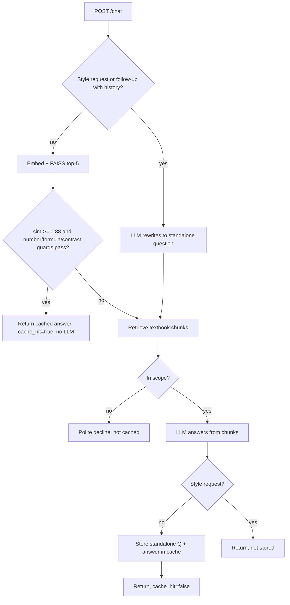

# Approach: NCERT Class 10 Science Chatbot with Safe Caching

**Chatbot.** Textbook PDFs → chunks (1000 chars, 150 overlap) tagged with chapter name → FAISS (MiniLM embeddings). A question retrieves top 4 chunks; the LLM must answer only from them or output `OUT_OF_SCOPE`. A cheap similarity gate declines clearly off-topic questions without any LLM call. Citations = chapters of the retrieved chunks.

**Cache = recall + safety.** Embedding similarity alone is unsafe: "concave" vs "convex" mirror questions and "R = 20 cm" vs "R = 30 cm" embed almost identically. So a candidate is served only if it passes *all*:
1. Cosine similarity ≥ 0.88 (FAISS inner product on normalised vectors).
2. **Number guard:** the multiset of numbers must be identical.
3. **Formula guard:** chemical formulas (HCl, NaOH, CO2) must match.
4. **Contrast guard:** for ~35 opposing concept groups (concave/convex, real/virtual, acid/base, series/parallel, mitosis/meiosis…), both questions must contain the same members.
Hits run only the embedder + FAISS + string checks, so no LLM call and typically tens of ms.

**Conversation handling.** A message is *conversation-dependent* if it has an anaphor ("it", "its", "they", "what about…") with prior history, or a style request ("simpler", "shorter", "in Hindi", "another example").
- Dependent messages **never read** the cache. Follow-ups are rewritten into a standalone question by the LLM, answered, and stored under that standalone question (safe for reuse by anyone).
- Style requests are answered with chat history and **never stored**.

**Never cached:** out-of-scope declines, style/“explain simpler” replies, anything from a failed/empty retrieval.

**What didn't work / trade-offs.** Pure threshold matching fails the concave/convex and number cases (the reason for the guards). Raising the threshold to ~0.95 to compensate kills legitimate paraphrase hits. The guards are rule-based, so an unlisted contrast pair could slip through; the fix is extending `CONTRAST`. Dependent follow-ups cost an LLM call even if the topic was seen before — a deliberate choice for correctness over hit rate.
*(Add your own measured results here: hit rate and latency on a test set of paraphrases / near-miss pairs.)*
